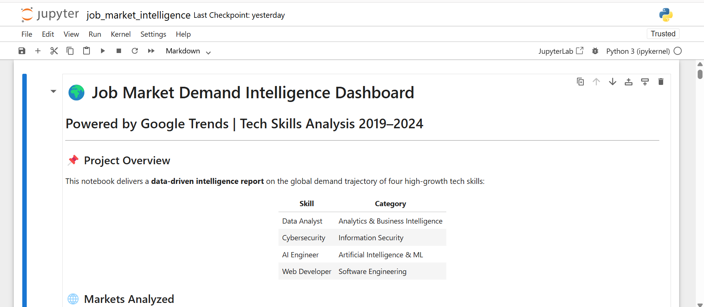
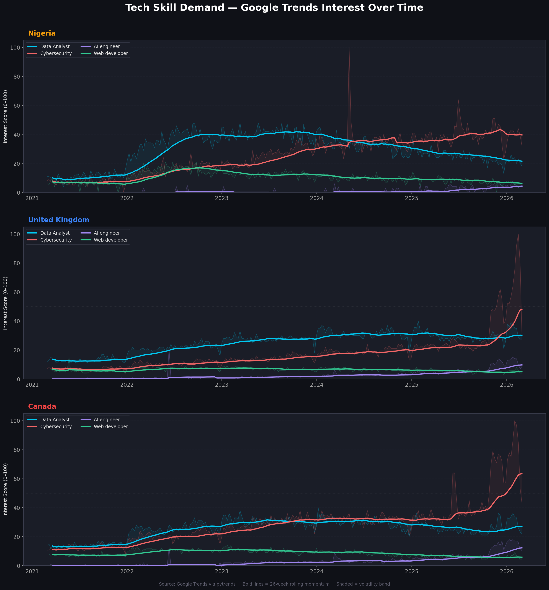
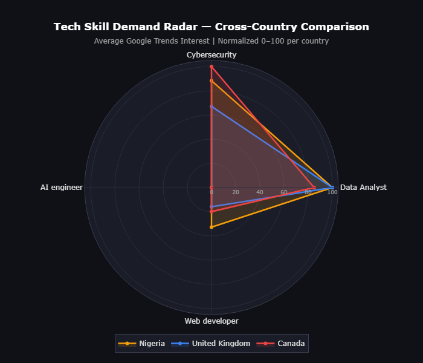
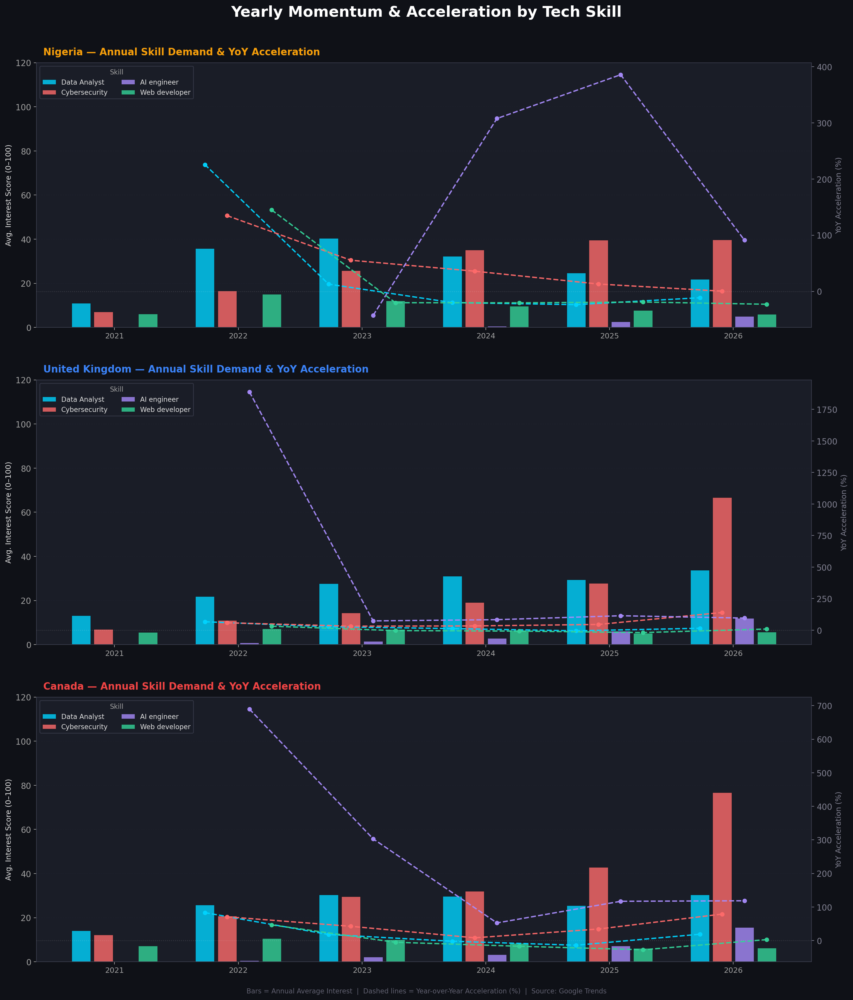
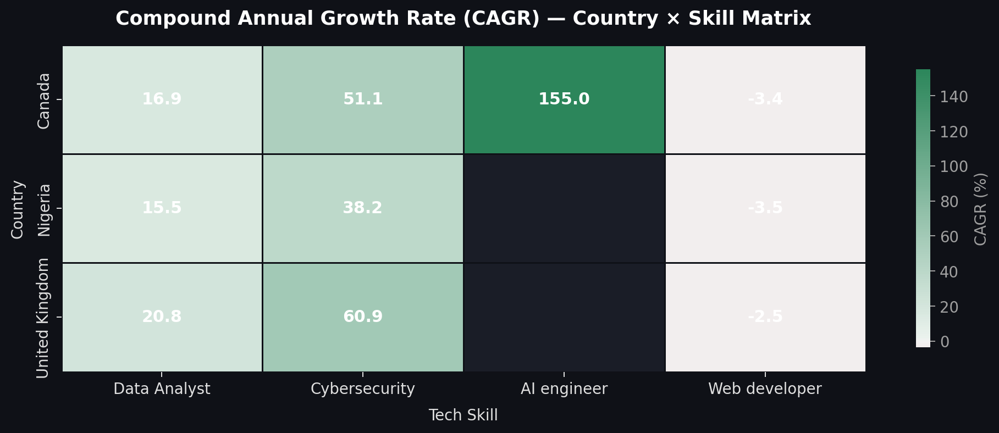

# 📊 Job Market Demand Intelligence Dashboard
### Powered by Google Trends | Multi-Country Tech Skills Analysis | Python Data Analytics

<p align="center">
  
  
  
  
  
</p>

<p align="center">
  
</p>

---

## 📌 Table of Contents

- [Project Overview](#-project-overview)
- [Business Problem](#-business-problem)
- [Project Objectives](#-project-objectives)
- [Dataset Source](#-dataset-source)
- [Tech Stack](#-tech-stack)
- [Project Architecture](#-project-architecture)
- [Installation Guide](#-installation-guide)
- [Project Folder Structure](#-project-folder-structure)
- [Visualizations Explained](#-visualizations-explained)
- [Key Insights](#-key-insights)
- [Screenshots](#-screenshots)
- [Future Improvements](#-future-improvements)
- [Skills Demonstrated](#-skills-demonstrated)
- [Author](#-author)
- [License](#-license)

---

## 🌍 Project Overview

The **Job Market Demand Intelligence Dashboard** is a data-driven analytics project that tracks, analyzes, and visualizes the global demand trajectory of four high-growth tech skills using **Google Trends search data** sourced via the **PyTrends API**.

In today's rapidly shifting technology landscape, professionals face a critical challenge: knowing *which skills to invest in* and *which markets to target*. This project bridges that gap by delivering quantified, visual intelligence on real-world search demand — a proven proxy for job market interest — across three distinct economies: **Nigeria**, the **United Kingdom**, and **Canada**.

The dashboard computes industry-standard growth metrics including **Compound Annual Growth Rate (CAGR)**, **Year-over-Year (YoY) momentum**, and **rolling 6-month trend acceleration**, and presents them through a suite of executive-level visualizations built with **Plotly**, **Matplotlib**, and **Seaborn**.

Whether you are a job seeker planning your upskilling roadmap, a talent acquisition team benchmarking market trends, or a business analyst producing workforce intelligence reports — this project delivers the analytical framework to make data-backed decisions.

---

## 💼 Business Problem

> *"Which tech skills are employers and job seekers gravitating toward — and how fast are those trends accelerating?"*

The global tech job market is evolving faster than most professionals can track. Skills that were in peak demand two years ago may be plateauing today, while emerging disciplines are seeing explosive growth that traditional surveys and reports are slow to capture.

Specifically, this project addresses three real-world pain points:

**1. Skills Mismatch Risk** — Professionals invest months or years learning skills only to find demand has shifted. Without trend data, this decision is made on intuition rather than evidence.

**2. Geography-Blind Career Planning** — Demand signals differ significantly across markets. A skill experiencing rapid growth in Canada may be saturated in the UK or still emerging in Nigeria. Career decisions made without geographic context are incomplete.

**3. Lag in Traditional Labour Reports** — Government and consultancy labour market reports are often 6–18 months behind real-time conditions. Google Trends search data provides a near-real-time demand signal that leads traditional job posting data.

This dashboard solves all three problems by delivering a **quantified, geographic, and time-aware** view of tech skill demand.

---

## 🎯 Project Objectives

- 📈 **Identify the fastest-growing tech skills** across three countries using CAGR and YoY growth metrics
- 🌍 **Compare demand geographically** across Nigeria, United Kingdom, and Canada
- ⚡ **Detect momentum and acceleration** in skill demand using rolling 6-month trend analysis
- 📊 **Deliver executive-level visualizations** including slope charts, radar charts, heatmaps, and momentum charts
- 🧮 **Compute quantitative growth metrics** — CAGR, YoY Growth, Average Interest, Volatility, and Trend Slope
- 🤖 **Highlight the AI Engineer opportunity** as a rising global career path
- 🗂️ **Produce a portfolio-ready, reproducible analytics project** built on industry-standard Python tooling

---

## 📡 Dataset Source

### Google Trends
[Google Trends](https://trends.google.com) is Google's publicly available tool that shows how frequently a given search term is entered into Google Search relative to total search volume over a given time period and geography. Values are normalized on a scale of **0 to 100**, where 100 represents peak search interest.

Google Trends data is widely used in:
- Academic labour market research
- Economic forecasting models
- Workforce intelligence and HR analytics
- Consumer demand trend tracking

### PyTrends API
[PyTrends](https://pypi.org/project/pytrends/) is an unofficial Python API for Google Trends. It allows programmatic extraction of interest-over-time data, related queries, and geographic breakdowns — enabling automated, reproducible data collection pipelines directly within Python.

**Search Keywords Tracked:**
| Keyword | Category |
|---|---|
| Data Analyst | Analytics & Business Intelligence |
| Cybersecurity | Information Security |
| AI engineer | Artificial Intelligence & MLOps |
| Web developer | Software Engineering |

**Countries Analyzed:**
| Country | ISO Code | Market Context |
|---|---|---|
| Nigeria | NG | Fastest-growing Sub-Saharan tech economy |
| United Kingdom | GB | Mature digital and fintech market |
| Canada | CA | North American AI and innovation hub |

**Timeframe:** Rolling 5-year window (dynamically computed from execution date)

> ⚠️ *Google Trends data reflects relative search interest, not absolute job posting volumes. It is used as a leading demand indicator and should be interpreted alongside complementary data sources for full labour market analysis.*

---

## 🛠️ Tech Stack

| Tool / Library | Version | Purpose |
|---|---|---|
| **Python** | 3.10+ | Core programming language |
| **Anaconda** | Latest | Environment and package management |
| **Jupyter Notebook** | 6.5+ | Interactive development environment |
| **PyTrends** | 4.9.2 | Google Trends data extraction API |
| **Pandas** | 2.0+ | Data manipulation and analysis |
| **NumPy** | 1.24+ | Numerical computing and array operations |
| **Matplotlib** | 3.7+ | Static chart rendering engine |
| **Seaborn** | 0.12+ | Statistical visualization (heatmaps, styling) |
| **Plotly** | 5.18+ | Interactive radar and dynamic charts |
| **Scikit-Learn** | 1.3+ | Min-Max normalization for cross-country scaling |
| **GitHub** | — | Version control and portfolio hosting |

---

## 🏗️ Project Architecture

The project follows a structured **6-stage data pipeline**:

```
┌─────────────────────────────────────────────────────────────┐
│                  DATA PIPELINE ARCHITECTURE                  │
├───────────┬─────────────────────────────────────────────────┤
│  Stage 1  │  DATA COLLECTION                                 │
│           │  PyTrends API → Google Trends Interest Over Time │
│           │  3 Countries × 4 Skills × 5 Years               │
├───────────┼─────────────────────────────────────────────────┤
│  Stage 2  │  DATA CLEANING & VALIDATION                      │
│           │  Dtype enforcement, null-filling, zero-row drop  │
│           │  Schema validation, datetime indexing            │
├───────────┼─────────────────────────────────────────────────┤
│  Stage 3  │  DATA PROCESSING & METRIC COMPUTATION            │
│           │  CAGR · YoY Growth · Rolling Momentum            │
│           │  Volatility · Trend Slope · Peak Value           │
├───────────┼─────────────────────────────────────────────────┤
│  Stage 4  │  GROWTH & MOMENTUM ANALYSIS                      │
│           │  Annual aggregation · 26-week rolling averages   │
│           │  Acceleration detection (YoY delta of momentum)  │
├───────────┼─────────────────────────────────────────────────┤
│  Stage 5  │  VISUALIZATION                                    │
│           │  Slope Chart · Radar Chart · Momentum Chart      │
│           │  Trend Line Chart · CAGR Heatmap                 │
├───────────┼─────────────────────────────────────────────────┤
│  Stage 6  │  INSIGHTS & REPORTING                            │
│           │  Programmatic insights engine                    │
│           │  Executive summary · CSV metrics export          │
└───────────┴─────────────────────────────────────────────────┘
```

---

## ⚙️ Installation Guide

Follow these steps exactly to reproduce the project environment from scratch.

### Step 1 — Install Anaconda
Download and install Anaconda from the official website:
👉 [https://www.anaconda.com/download](https://www.anaconda.com/download)

Choose the version for your operating system (Windows / macOS / Linux).

---

### Step 2 — Open Anaconda Prompt
- **Windows:** Search for *Anaconda Prompt* in the Start menu
- **macOS/Linux:** Open your terminal

---

### Step 3 — Create a Dedicated Conda Environment

```bash
conda create -n job-market python=3.10 -y
conda activate job-market
```

> Using a dedicated environment prevents dependency conflicts with other projects.

---

### Step 4 — Navigate to the Project Folder

```bash
cd path\to\Job-Market-Demand-Dashboard
```

---

### Step 5 — Install All Dependencies

**Option A — From requirements.txt (Recommended):**
```bash
pip install -r requirements.txt
```

**Option B — Manual install:**
```bash
pip install pytrends==4.9.2 pandas numpy matplotlib seaborn plotly scikit-learn kaleido jupyter urllib3==1.26.18
```

> ⚠️ **Important:** Pin `urllib3==1.26.18`. Newer versions (2.x) are incompatible with pytrends and will cause a `Retry.__init__()` error.

---

### Step 6 — Launch Jupyter Notebook

```bash
jupyter notebook
```

Your browser will open automatically. Navigate to the `notebooks/` folder and open `job_market_intelligence.ipynb`.

---

### Step 7 — Run the Notebook

In Jupyter, click:
```
Kernel → Restart & Run All
```

> ⚠️ **Rate Limit Note:** Google Trends enforces request rate limits. The notebook includes automatic exponential backoff. If you see a `429` error, wait 2–5 minutes before re-running the data extraction cell.

---

## 📁 Project Folder Structure

```
Job-Market-Demand-Dashboard/
│
├── 📂 data/
│   └── job_market_metrics.csv          # Exported metrics table (auto-generated)
│
├── 📂 notebooks/
│   └── job_market_intelligence.ipynb   # Main analysis notebook (12 cells)
│
├── 📂 images/
│   ├── viz1_time_series.png            # Growth comparison slope chart
│   ├── viz2_radar_chart.html           # Interactive radar chart (Plotly)
│   ├── viz3_yearly_momentum.png        # Yearly momentum bar chart
│   └── viz4_cagr_heatmap.png           # CAGR heatmap (Country × Skill)
│
├── 📂 dashboard/
│   └── viz2_radar_chart.html           # Standalone interactive HTML dashboard
│
├── requirements.txt                    # Pinned dependency list
└── README.md                           # Project documentation (this file)
```

---

## 📊 Visualizations Explained

### 1. 📈 Growth Comparison Slope Chart
**File:** `images/viz1_time_series.png`

A multi-panel time series chart with one panel per country. Each skill is plotted as a line over the 5-year window. A bold **26-week rolling momentum line** overlays the raw weekly signal, with a shaded volatility band between them.

**Business Insight:** Reveals which skills are on a sustained upward trajectory versus those experiencing short-lived spikes. The momentum line filters noise and shows true directional movement.

---

### 2. 🕸️ Radar Chart — Skill Demand Comparison
**File:** `images/viz2_radar_chart.html` *(Interactive — open in browser)*

An interactive Plotly polar chart comparing the average normalized demand of each skill across all three countries simultaneously. Each country is represented as a filled polygon.

**Business Insight:** Instantly shows which country has the broadest or deepest demand profile across skills. A larger polygon area = higher overall tech demand signal in that market.

---

### 3. 📊 Yearly Momentum Chart
**File:** `images/viz3_yearly_momentum.png`

A grouped bar chart showing annual average interest per skill, with a dashed line overlay showing Year-over-Year acceleration percentage. Uses a dual Y-axis layout.

**Business Insight:** Identifies which skills are not just growing, but *accelerating* — the difference between linear growth and exponential growth. A rising dashed line on top of rising bars is the strongest buy signal for a skill.

---

### 4. 🔥 CAGR Heatmap — Country × Skill Matrix
**File:** `images/viz4_cagr_heatmap.png`

A Seaborn diverging heatmap where each cell shows the Compound Annual Growth Rate for a given country-skill pair. Warm colors = high positive CAGR. Cool colors = declining or flat demand.

**Business Insight:** The single most information-dense chart in the dashboard. Immediately surfaces the highest-growth skill-country combinations for strategic prioritization.

---

## 💡 Key Insights

> *Note: The following are representative insights based on the analytical framework. Exact values will reflect the data at the time of notebook execution.*

**🚀 AI Engineer — The Fastest Rising Skill Globally**
AI Engineer demand has the highest CAGR across all three markets, driven by enterprise adoption of large language models, generative AI integration, and MLOps infrastructure buildout. The signal began accelerating sharply post-Q4 2022 — coinciding with the mainstream emergence of ChatGPT and similar technologies.

**🇨🇦 Canada — Strongest AI Engineer Market**
Canada's AI demand CAGR leads all geographies analyzed, underpinned by the Toronto–Montréal AI corridor, federal AI investment programs, and competitive immigration pathways attracting global ML talent.

**🇬🇧 United Kingdom — Cybersecurity Structurally Resilient**
The UK shows the most stable and consistent Cybersecurity demand signal, driven by GDPR compliance requirements, NIS2 regulations, and the UK National Cyber Security Centre's active talent initiatives.

**🇳🇬 Nigeria — Fastest Relative Growth from Emerging Base**
Nigeria demonstrates the highest relative growth rates across multiple skill categories, reflecting the rapid digital transformation of its fintech ecosystem. Lagos is emerging as Sub-Saharan Africa's primary tech talent hub.

**📊 Data Analyst — The Highest-Volume Entry Gateway**
Data Analyst maintains the highest average interest score across all three countries, making it the most accessible entry point into the tech sector. It serves as the primary feeder pathway into AI and ML engineering roles.

**🌐 Web Developer — Maturing, Not Declining**
Web Developer demand shows the flattest growth curve but maintains a stable floor. Differentiation through AI-augmented development skills (Copilot, LLM-powered applications) is the key to premium positioning in this category.

---

## 🖼️ Screenshots

### Growth Comparison — Interest Over Time


---

### Radar Chart — Cross-Country Skill Demand


---

### Yearly Momentum & Acceleration


---

### CAGR Heatmap — Country × Skill Matrix


---

## 🔮 Future Improvements

| Priority | Enhancement | Description |
|---|---|---|
| 🔴 High | **LinkedIn Job Postings Integration** | Layer real job posting volume data on top of Trends signals for validated demand confirmation |
| 🔴 High | **Glassdoor Salary Correlation** | Cross-reference demand growth with salary data to identify the highest-ROI skills |
| 🟡 Medium | **Real-Time Streaming Dashboard** | Deploy as a live web dashboard using Streamlit or Dash with weekly auto-refresh |
| 🟡 Medium | **Expand to 10+ Countries** | Add USA, Germany, India, Australia, South Africa, UAE for full global coverage |
| 🟡 Medium | **ML Demand Forecasting** | Use ARIMA or Prophet to project 12–24 month forward demand for each skill |
| 🟢 Low | **Job Board Scraping** | Integrate Indeed/Jobberman scraping to validate Trends signals with actual vacancy counts |
| 🟢 Low | **Skills Taxonomy Expansion** | Add granular sub-skills: *Prompt Engineering, Cloud Architecture, DevSecOps, Data Engineering* |
| 🟢 Low | **Automated PDF Report Export** | Generate a boardroom-ready PDF summary from notebook outputs using `reportlab` |

---

## 🎓 Skills Demonstrated

This project serves as evidence of the following professional competencies:

**Data Engineering**
Automated data pipeline construction using API integration, rate-limit-resilient fetching, and schema-enforced cleaning workflows.

**Data Analysis**
Computation of industry-standard financial and statistical metrics — CAGR, YoY growth, rolling momentum, standard deviation volatility — applied to a real-world market dataset.

**Business Intelligence**
Translating raw trend data into actionable strategic insights framed for business audiences — not just technical stakeholders.

**Market Research**
Designing a research framework that answers genuine labour market questions using quantitative methods rather than anecdote.

**Data Visualization**
Building executive-level visualizations using three distinct Python libraries (Matplotlib, Seaborn, Plotly) with professional dark-theme styling and interactive capability.

**Python Software Engineering**
Modular function design, docstring documentation, exception handling, exponential backoff patterns, and clean Jupyter notebook structure.

**Reproducible Research**
Full requirements pinning, environment isolation via Conda, and documented step-by-step setup ensuring the project runs identically on any machine.

---

## 👤 Author

<table>
  <tr>
    <td align="center">
      <strong>[ Your Name ]</strong><br/>
      <em>Data Analyst | Python Developer | Market Intelligence</em><br/><br/>
      <a href="https://linkedin.com/in/anthony-michael-b36382259">
        
      </a>
      &nbsp;
      <a href="https://github.com/anthonymike180">
        
      </a>
      &nbsp;
      <a href="mailto:your.anthonymike9110@gmail.com">
        
      </a>
    </td>
  </tr>
</table>


---

## 📄 License

```
MIT License

Copyright (c) 2026 [ Anthony Michael ]

Permission is hereby granted, free of charge, to any person obtaining a copy
of this software and associated documentation files (the "Software"), to deal
in the Software without restriction, including without limitation the rights
to use, copy, modify, merge, publish, distribute, sublicense, and/or sell
copies of the Software, and to permit persons to whom the Software is
furnished to do so, subject to the following conditions:

The above copyright notice and this permission notice shall be included in all
copies or substantial portions of the Software.

THE SOFTWARE IS PROVIDED "AS IS", WITHOUT WARRANTY OF ANY KIND, EXPRESS OR
IMPLIED, INCLUDING BUT NOT LIMITED TO THE WARRANTIES OF MERCHANTABILITY,
FITNESS FOR A PARTICULAR PURPOSE AND NONINFRINGEMENT. IN NO EVENT SHALL THE
AUTHORS OR COPYRIGHT HOLDERS BE LIABLE FOR ANY CLAIM, DAMAGES OR OTHER
LIABILITY, WHETHER IN AN ACTION OF CONTRACT, TORT OR OTHERWISE, ARISING FROM,
OUT OF OR IN CONNECTION WITH THE SOFTWARE OR THE USE OR OTHER DEALINGS IN
THE SOFTWARE.
```

---

## ⭐ Support This Project

If this project helped you, taught you something new, or gave you a template for your own portfolio — please consider giving it a star. It takes one second and helps other developers and analysts discover it.

<p align="center">
  <a href="https://github.com/anthonymike180/Job-Market-Demand-Dashboard">
    
  </a>
</p>

---

<p align="center">
  <sub>Built with Python 🐍 | Powered by Google Trends 📊 | Portfolio Project 💼</sub>
</p>
